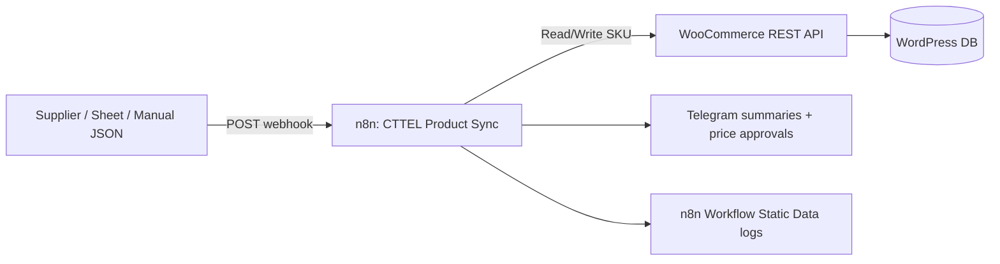

# CTTEL WooCommerce ↔ n8n Product Automation

WooCommerce remains the **source of truth** for products, prices, and stock. n8n orchestrates upserts via the **standard WooCommerce REST API** (`/wp-json/wc/v3`).

No separate backend, no new database, no storefront changes.

## Architecture



### Flow (per product)

1. Lookup product by **SKU** (`GET /products?sku=`).
2. Validate prices (reject negative/zero unless allowed); **do not clear** `sale_price` when omitted.
3. Compute price delta; if **> 15%** → skip write, send **Telegram approval** message.
4. Stock: `quantity >= 0`; `0` → `outofstock`, `> 0` → `instock`; malformed → skip + log.
5. Category: match existing WooCommerce category **by slug**; unknown → Telegram `UNKNOWN CATEGORY` (no auto-create).
6. Image: sideload via `images[].src` only when URL is new for that product.
7. Meta `_cttel_installment_available` (`yes`/`no`) via mu-plugin REST registration.
8. `featured` only when explicitly `true`/`false` in input.
9. **DRY_RUN**: no writes; preview in response + Telegram summary.

### Safety

- Never DELETE products, reset DB, or bulk-delete categories/images.
- Failed API calls log errors; other items in batch continue (fail-safe per SKU).
- First production test must use `"dry_run": true`.

## Files

| Path | Purpose |
|------|---------|
| `workflows/cttel-product-sync.json` | Import into n8n |
| `sample-input.json` | DRY_RUN sample payload |
| `lib/product-sync-logic.mjs` | Shared rules (local tests) |
| `scripts/dry-run-test.mjs` | Local logic test |
| `scripts/verify-wc-api.sh` | Public API readiness check |
| `docs/WOOCOMMERCE-API-SETUP.md` | API key creation |
| `docs/CREDENTIALS-CHECKLIST.md` | n8n + env checklist |
| `docs/ROLLBACK.md` | Rollback strategy |

## Deploy mu-plugin (REST meta)

On VPS (when updating WordPress files only):

```bash
docker cp mu-plugins/cttel-wc-rest-automation.php wp_app:/var/www/html/wp-content/mu-plugins/
```

Or include in your next `apply-customer-storefront.sh` mu-plugin sync.

## Import workflow

1. n8n → **Workflows** → **Import from File** → `workflows/cttel-product-sync.json`
2. Create credentials **CTTEL n8n Automation** (WooCommerce API) — see checklist.
3. Link credentials on **Process Products** and Telegram nodes.
4. Set n8n environment variable `TELEGRAM_CHAT_ID` (optional; or replace placeholder in nodes).
5. Activate workflow; note webhook URL: `https://<n8n-host>/webhook/cttel-product-sync`

## Test (DRY RUN)

```bash
node automation/scripts/dry-run-test.mjs

curl -X POST 'https://<n8n-host>/webhook/cttel-product-sync' \
  -H 'Content-Type: application/json' \
  -d @automation/sample-input.json
```

Expect `"dry_run": true` in JSON response and Telegram summary without product changes in WooCommerce.

## Rollback

See `docs/ROLLBACK.md`.
