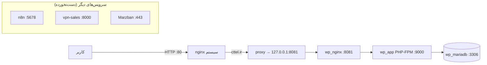

# گزارش کلی — فروشگاه CTTEL (WordPress + WooCommerce)

**تاریخ به‌روزرسانی:** ۱۳ سپتامبر ۲۰۲۶  
**پروژه:** فروشگاه اینترنتی CTTEL  
**دامنه هدف:** [cttel.ir](https://cttel.ir)  
**مخزن:** [cursor-mastery](https://github.com/abdeshahi/cursor-mastery) — PR [#13](https://github.com/abdeshahi/cursor-mastery/pull/13)

---

## ۱. خلاصه وضعیت

| مورد | وضعیت |
|------|--------|
| نصب روی VPS | ✅ انجام شد |
| WordPress فارسی (fa_IR) | ✅ فعال |
| WooCommerce 9.6.2 | ✅ فعال |
| HTTP روی VPS | ✅ پاسخ 200 (با Host: cttel.ir) |
| SSL (HTTPS) | ⏳ در انتظار تغییر DNS |
| DNS cttel.ir | ⚠️ هنوز به IP قدیمی اشاره می‌کند |
| سرویس‌های قبلی (n8n, Marzban, VPN) | ✅ سالم — بدون تغییر |
| بکاپ روزانه (cron) | ✅ نصب شده |

---

## ۲. اطلاعات سرور

| مورد | مقدار |
|------|--------|
| **IP VPS** | `185.18.214.66` |
| **Hostname** | `server3.panel01.com` |
| **ارائه‌دهنده** | صفر و یک پرداز (0-1.ir) — سرویس #654351 |
| **سیستم‌عامل** | Ubuntu (kernel 6.8) |
| **CPU** | 1 vCore |
| **RAM** | 2 GB |
| **Disk** | 40 GB SATA |
| **مسیر نصب** | `/opt/cttel-wordpress/app` |

### مصرف منابع (لحظه گزارش)

| منبع | مقدار |
|------|--------|
| RAM | ~1.3 GB / 1.9 GB (~69%) |
| Disk | 17 GB / 40 GB (44%) |
| Swap | 3 GB (فعال) |

---

## ۳. معماری عملیاتی

به‌دلیل اشغال بودن پورت 80 توسط nginx سیستم (Marzban/VPN)، WordPress با معماری **دو‌لایه nginx** اجرا می‌شود:



### چرا پورت 8081؟

- nginx سیستم روی `:80` برای ACME و Marzban/VPN فعال است.
- کانتینر `wp_nginx` روی `127.0.0.1:8081` listen می‌کند.
- vhost جدید `/etc/nginx/sites-available/cttel-wordpress` درخواست‌های `cttel.ir` را proxy می‌کند.
- **هیچ سرویس قبلی stop یا حذف نشده.**

---

## ۴. سرویس‌های Docker

| Container | Image | وضعیت | نقش |
|-----------|-------|--------|-----|
| `wp_mariadb` | mariadb:10.11 | Up (healthy) | پایگاه داده |
| `wp_app` | wordpress:6.7-php8.2-fpm | Up | WordPress + PHP-FPM |
| `wp_nginx` | nginx:1.27-alpine | Up | وب‌سرور داخلی (8081) |

### سرویس‌های دیگر VPS (بدون تغییر)

| سرویس | وضعیت |
|--------|--------|
| n8n | active (پورت 5678) |
| Marzban | Up 45+ hours |
| vpn-sales-postgres | Up (healthy) |
| vpn-sales API | پورت 8000 |
| nginx سیستم | active |

---

## ۵. پورت‌ها

| پورت | سرویس | دسترسی | توضیح |
|------|--------|--------|-------|
| 22 | SSH | عمومی | مدیریت VPS |
| 80 | nginx سیستم | عمومی | cttel.ir + ACME |
| 443 | xray/Marzban | عمومی | VPN (موجود قبلی) |
| 8081 | wp_nginx | localhost | WordPress داخلی |
| 3306 | MariaDB | localhost | DB WordPress |
| 9000 | PHP-FPM | localhost | WordPress |
| 5678 | n8n | عمومی | اتوماسیون (موجود قبلی) |
| 8000 | vpn-sales | عمومی | API VPN (موجود قبلی) |
| 8090/8443 | nginx proxy | عمومی | subscription VPN |

---

## ۶. WordPress و WooCommerce

| مورد | مقدار |
|------|--------|
| نسخه WordPress | 6.7.2 |
| Locale | `fa_IR` (RTL) |
| عنوان سایت | CTTEL |
| WooCommerce | 9.6.2 — فعال |
| Timezone | Asia/Tehran |
| Permalink | `/%postname%/` |
| URL تنظیم‌شده | `http://cttel.ir` |

### دسترسی پنل

| مورد | آدرس |
|------|------|
| سایت | `http://cttel.ir` (بعد از DNS) |
| پنل مدیریت | `http://cttel.ir/wp-admin` |
| Admin user | `admin` |
| رمز admin | در فایل CREDENTIALS.md روی VPS |

---

## ۷. DNS و SSL

### DNS (نیازمند اقدام)

| رکورد | مقدار فعلی | مقدار صحیح |
|--------|-----------|-----------|
| `cttel.ir` A | `212.33.194.35` ❌ | `185.18.214.66` ✅ |
| `www.cttel.ir` A | `212.33.194.35` ❌ | `185.18.214.66` ✅ |

تا DNS تغییر نکند، سایت از اینترنت روی `cttel.ir` در دسترس **نیست** (فقط با IP مستقیم + Host header کار می‌کند).

### SSL

| مورد | وضعیت |
|------|--------|
| گواهی Let's Encrypt | ❌ هنوز صادر نشده |
| ایمیل ACME | `admin@cttel.ir` |
| دستور فعال‌سازی | `./scripts/init-ssl.sh` (بعد از DNS) |

---

## ۸. امنیت و رمزها

### محل ذخیره رمزها

```bash
ssh root@185.18.214.66
cat /opt/cttel-wordpress/app/CREDENTIALS.md
```

| متغیر | کاربرد |
|--------|--------|
| `MYSQL_ROOT_PASSWORD` | root دیتابیس |
| `MYSQL_PASSWORD` | کاربر wordpress |
| `WORDPRESS_ADMIN_PASSWORD` | ورود wp-admin |

> **توجه:** فایل `.env` و `CREDENTIALS.md` در git commit نمی‌شوند.

### فایروال

فایروال VPS از قبل توسط ارائه‌دهنده/تنظیمات قبلی مدیریت می‌شود. اسکریپت `setup-firewall.sh` در repo موجود است.

---

## ۹. بکاپ

| مورد | مقدار |
|------|--------|
| زمان‌بندی | روزانه ساعت **02:00** |
| محل | `/opt/cttel-wordpress/app/backups/` |
| محتوا | `database.sql.gz` + `wordpress-files.tar.gz` |
| نگهداری | 7 روز |
| بکاپ دستی | `./scripts/backup.sh` |
| تمدید SSL (cron) | ساعت **03:00** |

---

## ۱۰. ساختار فایل‌ها

```
/opt/cttel-wordpress/
├── repo/                  # clone از GitHub
└── app/                   # پشته عملیاتی
    ├── docker-compose.yml
    ├── .env               # رمزها (محلی)
    ├── CREDENTIALS.md     # مستند رمزها
    ├── nginx/conf.d/      # wp_nginx (8081)
    ├── certbot/           # SSL (خالی تا DNS)
    ├── backups/           # بکاپ‌ها
    ├── scripts/           # deploy, backup, ssl, ...
    └── docs/
        └── REPORT.fa.md   # ← این گزارش
```

---

## ۱۱. دستورات مفید

```bash
# ورود به VPS
ssh root@185.18.214.66

# وضعیت WordPress
cd /opt/cttel-wordpress/app
docker compose ps
docker compose logs -f wp_app

# تست HTTP
curl -I -H "Host: cttel.ir" http://127.0.0.1/

# بکاپ دستی
./scripts/backup.sh

# SSL (بعد از DNS)
./scripts/init-ssl.sh

# ری‌استارت WordPress
docker compose restart wordpress nginx
```

---

## ۱۲. چک‌لیست

- [x] نصب Docker و پull imageها
- [x] MariaDB healthy
- [x] WordPress نصب با fa_IR
- [x] WooCommerce فعال
- [x] nginx proxy برای cttel.ir
- [x] cron بکاپ
- [x] سرویس‌های n8n/Marzban/VPN سالم
- [ ] DNS cttel.ir → 185.18.214.66
- [ ] SSL با Let's Encrypt
- [ ] تست HTTPS از اینترنت
- [ ] تنظیمات WooCommerce (درگاه پرداخت، حمل‌ونقل، ...)
- [ ] تم و طراحی فروشگاه CTTEL

---

## ۱۳. قدم‌های بعدی (اولویت‌بندی)

1. **DNS** — تغییر A record `cttel.ir` و `www.cttel.ir` به `185.18.214.66`
2. **SSL** — `./scripts/init-ssl.sh` (پس از propagate DNS)
3. **WooCommerce** — تنظیم فروشگاه: واحد پول (ریال)، درگاه پرداخت، صفحات shop/cart/checkout
4. **تم** — نصب تم فروشگاهی فارسی (مثلاً Astra + Elementor یا Storefront)
5. **ایمیل** — تنظیم SMTP برای اعلان‌های سفارش
6. **بکاپ خارجی** — کپی بکاپ‌ها به storage خارج VPS

---

## ۱۴. محدودیت‌ها و نکات

1. **RAM 2GB:** WordPress + WooCommerce + n8n + Marzban همزمان فشار زیادی دارند (~69% RAM). در صورت کندی، swap فعال است (3GB).
2. **DNS:** تا تغییر نکند، مشتریان cttel.ir سایت جدید را نمی‌بینند.
3. **SSL روی IP:** Let's Encrypt فقط با دامنه کار می‌کند.
4. **IP مستقیم:** `http://185.18.214.66/` بدون Host header → 404 (by design).
5. **به‌روزرسانی:** برای update پشته: `git pull` در repo + `docker compose pull && docker compose up -d`.

---

## ۱۵. نتیجه‌گیری

فروشگاه CTTEL با WordPress فارسی و WooCommerce روی VPS `185.18.214.66` **نصب و عملیاتی** است. سرویس‌های قبلی VPS (n8n، Marzban، VPN bot) بدون اختلال باقی مانده‌اند. **تنها مانع دسترسی عمومی، DNS نادرست cttel.ir** است — پس از تغییر DNS و فعال‌سازی SSL، فروشگاه آماده بهره‌برداری production خواهد بود.
