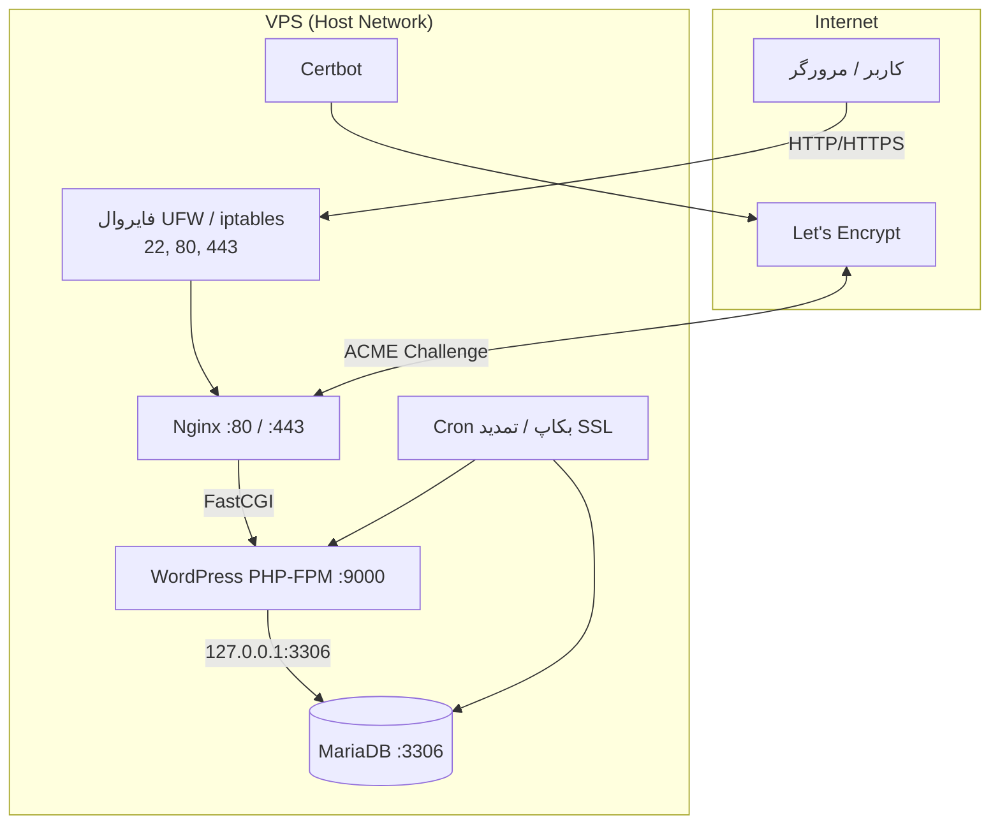

# گزارش کلی — سرور وردپرس + ووکامرس

**تاریخ:** ۱۳ سپتامبر ۲۰۲۶  
**پروژه:** پشته سبک WordPress + WooCommerce با Docker Compose  
**مخزن:** [cursor-mastery](https://github.com/abdeshahi/cursor-mastery)  
**PR:** [#13 — WordPress + WooCommerce Docker stack](https://github.com/abdeshahi/cursor-mastery/pull/13)

---

## ۱. خلاصه اجرایی

یک سرور فروشگاهی سبک بر پایه **Docker Compose** طراحی و پیاده‌سازی شد که شامل موارد زیر است:

| جزء | تکنولوژی |
|-----|-----------|
| وب‌سرور | Nginx 1.27 (Alpine) |
| پایگاه داده | MariaDB 10.11 |
| CMS | WordPress 6.7 (PHP 8.2 FPM) — **نسخه فارسی (fa_IR)** |
| فروشگاه | WooCommerce 9.6.2 |
| SSL | Certbot / Let's Encrypt |
| فایروال | UFW (با fallback به iptables) |
| بکاپ | Cron روزانه — DB + فایل‌ها |

**هدف:** راه‌اندازی سریع، امن و قابل نگهداری یک فروشگاه آنلاین فارسی روی VPS.

---

## ۲. معماری سیستم



### چرا `network_mode: host`؟

در برخی VPS/Cloud VMها (از جمله محیط Cloud Agent)، ارتباط بین کانتینرها روی شبکه bridge داکر مسدود است. با **host network** همه سرویس‌ها از طریق `127.0.0.1` با هم صحبت می‌کنند و Nginx تنها پورت‌های 80 و 443 را به بیرون expose می‌کند.

---

## ۳. سرویس‌ها و نسخه‌ها

| سرویس | Image | Container | Restart |
|--------|-------|-----------|---------|
| MariaDB | `mariadb:10.11` | `wp_mariadb` | unless-stopped |
| WordPress | `wordpress:6.7-php8.2-fpm` | `wp_app` | unless-stopped |
| Nginx | `nginx:1.27-alpine` | `wp_nginx` | unless-stopped |
| Certbot | `certbot/certbot:latest` | `wp_certbot` | on-demand (profile) |
| WP-CLI Init | `wordpress:cli-2.11-php8.2` | `wp_init` | one-shot |

---

## ۴. پورت‌ها و دسترسی

| پورت | پروتکل | سرویس | دسترسی از بیرون | توضیح |
|------|--------|--------|-----------------|-------|
| **22** | TCP | SSH | ✅ باز | مدیریت سرور |
| **80** | TCP | Nginx HTTP | ✅ باز | سایت + ACME challenge |
| **443** | TCP | Nginx HTTPS | ✅ باز | بعد از فعال‌سازی SSL |
| **3306** | TCP | MariaDB | ❌ بسته | bind روی `127.0.0.1` |
| **9000** | TCP | PHP-FPM | ❌ بسته | bind روی `127.0.0.1` |

---

## ۵. امنیت

### ۵.۱ فایروال

اسکریپت `scripts/setup-firewall.sh`:

1. ابتدا **UFW** را با قوانین زیر فعال می‌کند:
   - ورودی پیش‌فرض: **deny**
   - خروجی پیش‌فرض: **allow**
   - مجاز: 22, 80, 443
2. اگر UFW در محیط کار نکرد (محدودیت kernel/module)، **iptables** جایگزین می‌شود.

### ۵.۲ SSL (Let's Encrypt)

- روش: **webroot** (`/.well-known/acme-challenge/`)
- دریافت اولیه: `./scripts/init-ssl.sh`
- تمدید خودکار: cron ساعت **03:00** (همراه با reload Nginx)

### ۵.۳ رمزها

| متغیر | کاربرد |
|--------|--------|
| `MYSQL_ROOT_PASSWORD` | root دیتابیس |
| `MYSQL_PASSWORD` | کاربر `wordpress` |
| `WORDPRESS_ADMIN_PASSWORD` | ورود به `/wp-admin` |

- رمزها با `openssl rand` در `.env` تولید می‌شوند.
- فایل `.env` و `CREDENTIALS.md` در gitignore هستند.
- پس از deploy، `./scripts/write-credentials.sh` فایل **`CREDENTIALS.md`** را با تمام پورت‌ها و رمزها می‌سازد.

---

## ۶. بکاپ

| مورد | مقدار |
|------|-------|
| زمان‌بندی | روزانه ساعت **02:00** (cron) |
| محل ذخیره | `wordpress/backups/YYYYmmdd_HHMMSS/` |
| محتوا | `database.sql.gz` + `wordpress-files.tar.gz` |
| نگهداری | ۷ روز (قابل تغییر با `BACKUP_RETENTION_DAYS`) |
| بکاپ دستی | `./scripts/backup.sh` |

---

## ۷. راه‌اندازی (Deploy)

```bash
cd wordpress
chmod +x scripts/*.sh
./scripts/deploy.sh
```

### مراحل خودکار `deploy.sh`

1. تولید `.env` با رمزهای تصادفی (`generate-env.sh`)
2. تنظیم `DOMAIN` روی IP سرور (اگر هنوز `example.com` باشد)
3. بالا آوردن MariaDB + WordPress + Nginx
4. نصب WordPress فارسی + WooCommerce (`wp-init`)
5. ساخت `CREDENTIALS.md`

### مراحل دستی پس از Deploy

```bash
# 1. DNS: رکورد A دامنه → IP سرور
# 2. ویرایش .env
DOMAIN=yourdomain.com
LETSENCRYPT_EMAIL=admin@yourdomain.com

# 3. SSL
./scripts/init-ssl.sh

# 4. فایروال
sudo ./scripts/setup-firewall.sh

# 5. Cron بکاپ + تمدید SSL
./scripts/install-cron-backup.sh
```

---

## ۸. راه‌اندازی اولیه WordPress (wp-init)

اسکریپت `scripts/wp-init.sh` به‌صورت idempotent اجرا می‌شود:

- نصب WordPress با locale **fa_IR**
- فعال‌سازی RTL
- permalink: `/%postname%/`
- نصب و فعال‌سازی **WooCommerce 9.6.2** (سازگار با WP 6.7)
- timezone: `Asia/Tehran`

---

## ۹. اسکریپت‌ها

| اسکریپت | کاربرد |
|---------|--------|
| `deploy.sh` | راه‌اندازی کامل یک‌جا |
| `generate-env.sh` | تولید `.env` با رمز تصادفی |
| `wp-init.sh` | نصب WP فارسی + WooCommerce |
| `init-ssl.sh` | دریافت گواهی Let's Encrypt |
| `enable-ssl.sh` | فعال‌سازی HTTPS در Nginx |
| `setup-firewall.sh` | UFW یا iptables |
| `backup.sh` | بکاپ DB + فایل‌ها |
| `install-cron-backup.sh` | نصب cron بکاپ و تمدید SSL |
| `write-credentials.sh` | تولید `CREDENTIALS.md` |

---

## ۱۰. ساختار فایل‌ها

```
wordpress/
├── docker-compose.yml       # تعریف سرویس‌ها
├── .env.example             # نمونه متغیرهای محیطی
├── .env                     # رمزها (gitignore — تولید خودکار)
├── CREDENTIALS.md           # مستند رمزها (gitignore — بعد از deploy)
├── nginx/
│   ├── nginx.conf
│   └── conf.d/
│       ├── 00-http.conf
│       └── 01-ssl.conf.template
├── mariadb/conf.d/
│   └── bind-local.cnf       # bind 127.0.0.1
├── wordpress/
│   └── zzz-listen-local.conf # FPM روی 127.0.0.1:9000
├── certbot/
│   ├── conf/                # گواهی‌های SSL
│   └── www/                 # webroot ACME
├── backups/                 # بکاپ‌های روزانه
├── scripts/                 # اسکریپت‌های عملیاتی
└── docs/
    ├── DEPLOYMENT.fa.md     # راهنمای deploy
    └── REPORT.fa.md         # ← این گزارش
```

---

## ۱۱. Volumes داکر

| Volume | محتوا |
|--------|--------|
| `wordpress_db_data` | داده‌های MariaDB |
| `wordpress_wordpress_data` | فایل‌های WordPress (`/var/www/html`) |

---

## ۱۲. چک‌لیست پس از راه‌اندازی

- [ ] سایت روی HTTP باز می‌شود (`curl -I http://IP/`)
- [ ] پنل `/wp-admin` در دسترس است
- [ ] زبان سایت فارسی و RTL است
- [ ] WooCommerce در افزونه‌ها فعال است
- [ ] DNS دامنه به IP سرور اشاره دارد
- [ ] SSL با `./scripts/init-ssl.sh` فعال شده
- [ ] فایروال با `setup-firewall.sh` تنظیم شده
- [ ] Cron بکاپ نصب شده (`crontab -l`)
- [ ] `CREDENTIALS.md` بررسی و در جای امن ذخیره شده

---

## ۱۳. دستورات مفید

```bash
cd wordpress

# وضعیت سرویس‌ها
docker compose ps

# لاگ‌ها
docker compose logs -f nginx
docker compose logs -f wordpress
docker compose logs -f db

# ری‌استارت
docker compose restart nginx wordpress

# توقف (داده‌ها حفظ می‌شود)
docker compose down

# بکاپ دستی
./scripts/backup.sh
```

---

## ۱۴. محدودیت‌ها و نکات

1. **SSL روی IP:** Let's Encrypt برای IP صادر نمی‌کند — حتماً دامنه واقعی لازم است.
2. **WooCommerce نسخه:** نسخه 9.6.2 pin شده؛ نسخه 11+ به WordPress 7 نیاز دارد.
3. **UFW در Cloud VM:** ممکن است fail شود؛ iptables fallback خودکار اعمال می‌شود.
4. **رمزها:** هر deploy جدید رمزهای تازه تولید می‌کند — `CREDENTIALS.md` را بعد از هر deploy بخوانید.
5. **PR:** تغییرات در شاخه `cursor/wordpress-woocommerce-stack-72ff` — [PR #13](https://github.com/abdeshahi/cursor-mastery/pull/13).

---

## ۱۵. نتیجه‌گیری

پشته آماده production برای یک فروشگاه وردپرس فارسی با ووکامرس روی VPS فراهم شده است. با یک دستور `./scripts/deploy.sh` سرویس‌ها بالا می‌آیند؛ SSL، فایروال و بکاپ روزانه با اسکریپت‌های جداگانه تکمیل می‌شوند. تمام پورت‌ها و رمزها پس از deploy در `CREDENTIALS.md` مستند می‌شوند.
